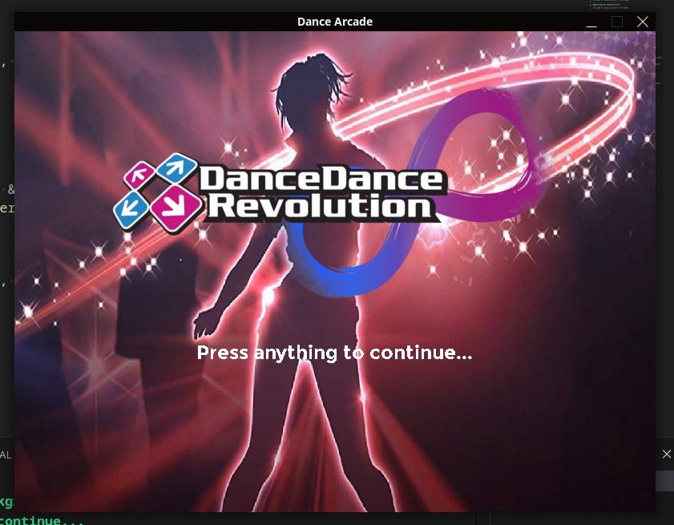

# dance-arcade

> CURRENTLY ON HOLD!

i wanna build a dance dance revolution like arcade machine fully from scratch both software and hardware-wise

## How to build?

For instructions on how to build navigate to either the software or hardware folder's README

## This is how it currently looks like:

 

(why does this picture not update lol)
